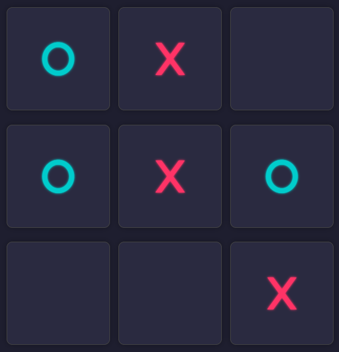

# 🎮 TicTacToe

A sleek, interactive **Tic-Tac-Toe** game built using **HTML**, **CSS**, **JavaScript**, and **Bootstrap**. Designed with a clean UI and intuitive user experience, this browser-based game supports two-player gameplay and dynamically highlights the winning pattern on the board.

 <!-- Replace with actual image path if available -->

---

## ✨ Features

- 🎯 **Two-Player Game Logic** — Play as X or O, alternating turns.
- 🧠 **Winner Detection** — Automatically checks and announces the winner or a draw.
- 📐 **Modern Responsive Design** — Built with Bootstrap 5 to ensure the game looks good on all screen sizes.
- 💡 **Winning Line Effect** — A professional animated line highlights the winning combination.
- 🎨 **Polished UI** — Subtle shadows, clean layout, and elegant glow effects for a visually engaging experience.
- 🕹️ **Reset Option** — Quickly restart the game and play again.

---

## 🛠️ Built With

- **HTML5** – Markup structure  
- **CSS3** – Styling and animations  
- **JavaScript (ES6)** – Game logic and interactivity  
- **Bootstrap 5** – Responsive layout and utilities

---

## 🚀 Getting Started

To try the project instantly in your browser:

🔗 **Live Preview:**  
[Click here to play now](https://htmlpreview.github.io/?https://github.com/SHROUDSOURAV/TicTacToe/blob/main/index.html)

To run the project locally:

1. Clone the repository:
   ```bash
   git clone https://github.com/SHROUDSOURAV/TicTacToe.git
